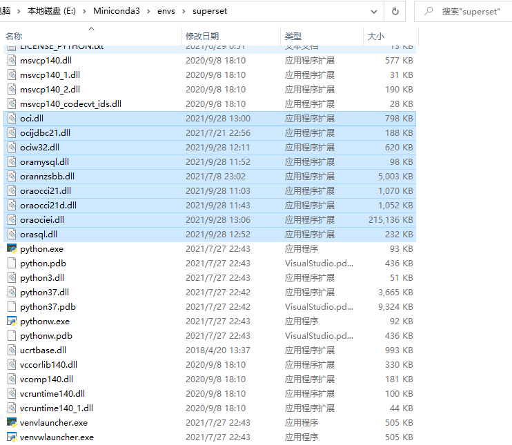

# superset连接oracle

[TOC]

## 1 操作过程

1. 安装驱动

```
(superset) E:\>conda install cx_Oracle
```

2. 安装 oracle 客户端(instantclient)


3. 将 instantclient 目录下的 dll 文件复制到 miniconda 目录下，见下图：



4. 重启 superset 服务

5. 在 oracle 中创建新用户，并赋予权限

```sql
CREATE TABLESPACE TEST
LOGGING
DATAFILE 'D:\ORACLE_TABLESPACE\TEST\TEST.DBF'
SIZE 100M
AUTOEXTEND ON
NEXT 100M MAXSIZE UNLIMITED
EXTENT MANAGEMENT LOCAL;

CREATE TEMPORARY TABLESPACE TEST_TEMP
TEMPFILE 'D:\ORACLE_TABLESPACE\TEST_TEMP\TEST_TEMP.DBF'
SIZE 100M
AUTOEXTEND ON
NEXT 100M MAXSIZE UNLIMITED
EXTENT MANAGEMENT LOCAL;

create user testuser identified by testuser2021 
  default tablespace TEST 
  temporary tablespace TEST_TEMP;  

grant connect,resource,dba to testuser;
```

6. superset 连接 oracle

```
oracle://testuser:testuser2021@<hostname>:<port>/<databasename>
```