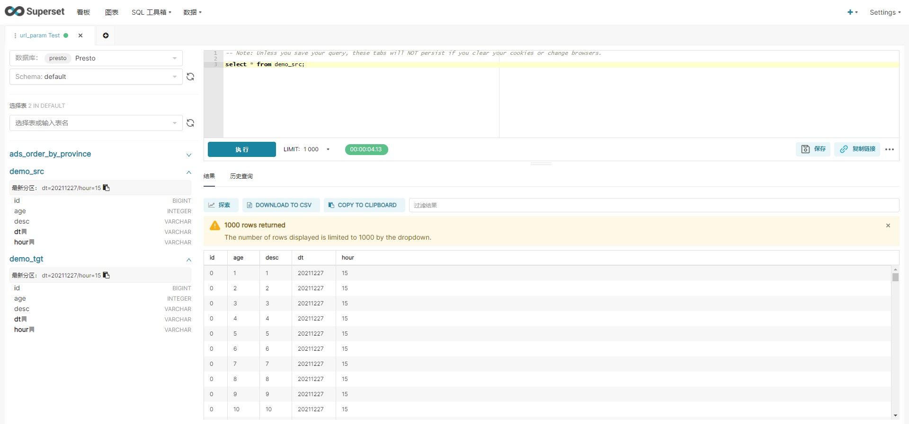

# superset连接presto

1. 安装驱动

```
conda install pyhvie
```

2. 重启 superset 服务

3. superset 连接 presto

```sh
# presto://{hostname}:{port}/{presto_catalog_name}/{hive_db_name}
presto://zgg:8881/hive/default
```


