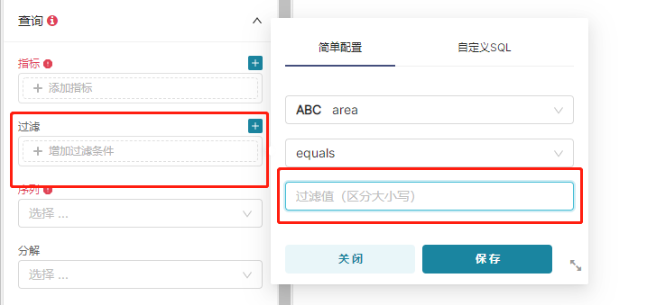

# 遇到的问题

[TOC]

### 问题

在使用 `Upload a CSV` 上传一个 csv 文件到 mysql 时，出现 `(_mysql_exceptions.OperationalError) (1366, "Incorrect string value:`。


csv 文件中的字段值是中文，而 superset 在自动创建表时，默认的编码是 latin1，所以需要修改字符编码为 utf8。

**TODO: 彻底修改建表时的编码**

```
区市县	圈层	区域
青羊区	一圈层	5+1区
锦江区	一圈层	5+1区
...
```

```sql
mysql> show create table area;
+-------+--------------------------------------------------------------------------------------------------------------------------------------------------------------------------------+
| Table | Create Table                                                                                                                                                                   |
+-------+--------------------------------------------------------------------------------------------------------------------------------------------------------------------------------+
| area  | CREATE TABLE `area` (
  `区市县` text CHARACTER SET latin1,
  `圈层` text CHARACTER SET latin1,
  `区域` text CHARACTER SET latin1
) ENGINE=InnoDB DEFAULT CHARSET=utf8        |
+-------+--------------------------------------------------------------------------------------------------------------------------------------------------------------------------------+
1 row in set (0.00 sec)

mysql> alter table area change 区市县 区市县 text character set utf8;
Query OK, 0 rows affected (0.05 sec)
Records: 0  Duplicates: 0  Warnings: 0

mysql> alter table area change 圈层 圈层  text character set utf8;               
Query OK, 0 rows affected (0.01 sec)
Records: 0  Duplicates: 0  Warnings: 0

mysql> alter table area change 区域 区域 text character set utf8;          
Query OK, 0 rows affected (0.00 sec)
Records: 0  Duplicates: 0  Warnings: 0
```

### 问题【待解决】

在使用 `Upload a CSV` 上传一个 tutorial_flights.csv 文件到 mysql 时，点击 save 后，没有跳转到 dataset 页面，还处在上传页面。使用数据集的前5行数据测试，则能成功上传。

### 问题

在测试官网 `building-custom-viz-plugins` 部分，出现如下问题：

```
(superset) E:\Miniconda3\envs\superset-ui>npm install -g yarn --registry=https://registry.npm.taobao.org
npm ERR! code EPERM
npm ERR! syscall mkdir
npm ERR! path E:\nodejs\node_cache\_cacache\tmp
npm ERR! errno EPERM
npm ERR! FetchError: Invalid response body while trying to fetch https://registry.npm.taobao.org/yarn: EPERM: operation not permitted, mkdir 'E:\nodejs\node_cache\_cacache\tmp'
```

清理缓存即可

删除用户名下的 `.npmrc` 文件

或执行 `npm cache clean --force` 清除

```
(superset) E:\Miniconda3>npm install -g yo @superset-ui/generator-superset
npm ERR! code ETIMEDOUT
npm ERR! syscall connect
npm ERR! errno ETIMEDOUT
npm ERR! network request to https://registry.npmjs.org/@superset-ui%2fgenerator-superset failed, reason: connect ETIMEDOUT 104.16.18.35:443
npm ERR! network This is a problem related to network connectivity.
npm ERR! network In most cases you are behind a proxy or have bad network settings.
npm ERR! network
npm ERR! network If you are behind a proxy, please make sure that the
npm ERR! network 'proxy' config is set properly.  See: 'npm help config'

npm ERR! A complete log of this run can be found in:
```

在用户名下的 `.npmrc` 文件中添加 `registry=https://registry.npm.taobao.org/`

### 问题

在桌面版的 centos7 中安装了 superset，在默认的火狐浏览器登录后，页面一直在 welcome 页面打转。

安装了 edge 浏览器则问题解决。

[因为 superset 用到了webpack.js，这个对于ie不支持。所以异步得不能加载。](https://ask.csdn.net/questions/1097192)

如何安装 edge 浏览器，点击 [这里](https://blog.csdn.net/Isana_Yashiro/article/details/109897023)

如何安装谷歌浏览器，点击 [这里](https://zhuanlan.zhihu.com/p/106071525)

### 问题

在使用搜狗浏览器做一张图，设置过滤条件时，填写中文出现闪退，不能输入的问题。版本为 1.4.1。



有可能是软件版本和浏览器的问题。

1.3.2 版本没有出现这个问题。使用 edge 和谷歌浏览器也没有出现这个问题。

### 问题

superset 创建 admin 用户失败报错：`Error! User already exists admin`

删除 superset.db 数据库文件，重新初始化数据库即可

```sh
[root@bigdata101 ~]# find / -name superset.db
/root/.superset/superset.db
[root@bigdata101 ~]# cd /root/.superset/
[root@bigdata101 .superset]# ls
superset.db
[root@bigdata101 .superset]# rm -f superset.db
```

### 问题

安装中出现 `No PIL installation found`，手动安装即可，`pip install pillow`

### 问题

执行 `conda create --name superset python=3.9` 时，一直不往下执行，或出现failed。

先执行 `conda config --show-sources` 查看 `.condarc` 文件位置，将其内容修改成如下内容

```
auto_activate_base: false
ssl_verify: true
channels:
  - http://mirrors.tuna.tsinghua.edu.cn/anaconda/pkgs/free/
  - http://mirrors.tuna.tsinghua.edu.cn/anaconda/pkgs/main/

show_channel_urls: true
```

### 问题


安装中，执行 `superset db upgrade`，出现：

`ImportError: cannot import name 'soft_unicode' from 'markupsafe' (/home/zgg/miniconda3/envs/superset/lib/python3.7/site-packages/markupsafe/__init__.py)`

通过执行 `pip show markupsafe` 查看 markupsafe 的版本是2.1.1，需要将其降到2.0.1

`python -m pip install markupsafe==2.0.1 --trusted-host https://repo.huaweicloud.com -i https://repo.huaweicloud.com/repository/pypi/simple`


如果出现 `ImportError: cannot import name 'TypedDict' from 'typing' (/home/zgg/miniconda3/envs/superset/lib/python3.7/typing.py)`，重新下载 superset，将 python 版本修改为3.9

`conda remove -n superset --all`

如果出现 `Error: Could not locate a Flask application. Use the 'flask --app' option, 'FLASK_APP' environment variable, or a 'wsgi.py' or 'app.py' file in the current directory.`，执行 `export FLASK_APP=superset`

如果出现 `ModuleNotFoundError: No module named 'werkzeug.wrappers.etag'`，werkzeug 版本需要从2.2.2降到2.0.1

`python -m pip install werkzeug==2.0.1 --trusted-host https://repo.huaweicloud.com -i https://repo.huaweicloud.com/repository/pypi/simple`

如果出现 `ModuleNotFoundError: No module named 'dataclasses'`，执行 `pip install dataclasses`

如果出现 `ImportError: cannot import name '_ColumnEntity'`，降低 sqlalchemy 的版本，执行 `pip install sqlalchemy==1.3.24`

### 问题

在连接oracle中，

`ERROR: (cx_Oracle.DatabaseError) DPI-1047: Cannot locate a 64-bit Oracle Client library: "The specified module could not be found". See https://cx-oracle.readthedocs.io/en/latest/user_guide/installation.html for help(Background on this error at: http://sqlalche.me/e/13/4xp6)`

原因是没有把 dll 文件复制到 miniconda 目录下。如果是 linux 系统复制 so 文件

`ERROR: (cx_Oracle.DatabaseError) DPI-1047: Cannot locate a 64-bit Oracle Client library: "libclntsh.so: cannot open shared object file: No such file or directory". See https://cx-oracle.readthedocs.io/en/latest/user_guide/installation.html for help
(Background on this error at: http://sqlalche.me/e/13/4xp6)`

修改 `/etc/ld.so.conf` 文件，加入 instantclient 解压目录，后执行 ldconfig。

### 问题

在连接oracle中，

`ERROR: (cx_Oracle.DatabaseError) ORA-12505: TNS: 监听程序当前无法识别连接描述符中所给出的 SID
(Background on this error at: http://sqlalche.me/e/13/4xp6)`

原因 oracle 客户端的 tnsnames.ora 配置文件配置错误。

### 问题

安装最新版本（3.0.0），执行 `superset db upgrade` 时，出现：

```
(superset) root@zgg-server:~# superset db upgrade
--------------------------------------------------------------------------------
                                    WARNING
--------------------------------------------------------------------------------
A Default SECRET_KEY was detected, please use superset_config.py to override it.
Use a strong complex alphanumeric string and use a tool to help you generate 
a sufficiently random sequence, ex: openssl rand -base64 42
--------------------------------------------------------------------------------
--------------------------------------------------------------------------------
Refusing to start due to insecure SECRET_KEY
```

解决：按照 WARNING 中的提示执行 `openssl rand -base64 42`，将产生的字符串添加到 `config.py` 中

```
(superset) root@zgg-server:~/miniconda3/envs/superset/lib/python3.10/site-packages/superset# vim config.py
# SECRET_KEY = os.environ.get("SUPERSET_SECRET_KEY") or CHANGE_ME_SECRET_KEY
SECRET_KEY = "T8teQJaGK9vDa7+BK4usauCTSAPgLMLu/jmGNuhtQx3puFuULjFY70Oq"
```
https://www.restack.io/docs/superset-knowledge-apache-superset-invalid-decryption-key

### 问题

输入用户名和密码，点登录后，命令行出现 `wtforms.validators.ValidationError: The CSRF session token is missing.`错误

解决：修改 superset/config.py 文件，把这两处改为False

```
TALISMAN_ENABLED = utils.cast_to_boolean(os.environ.get("TALISMAN_ENABLED", False))
WTF_CSRF_ENABLED = False
```
