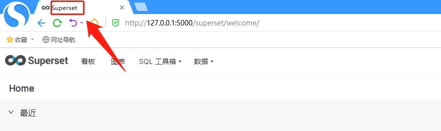
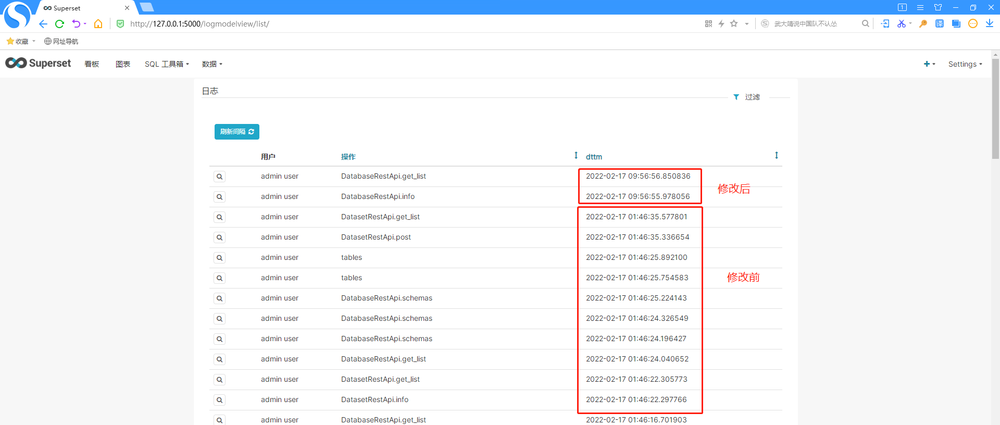
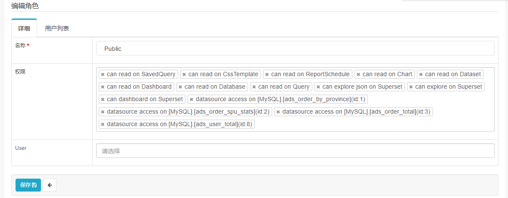
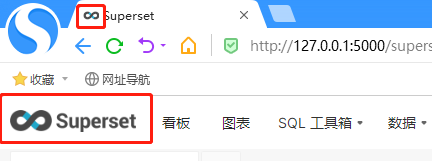
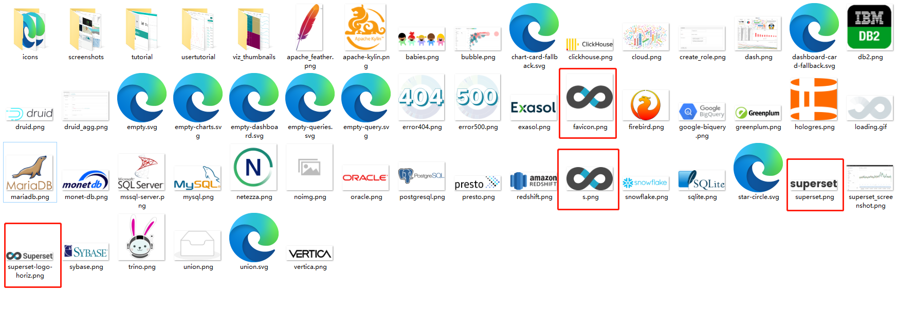

[TOC]

## 网页 title 修改



文件路径：`/opt/module/miniconda3/envs/superset/lib/python3.7/site-packages/superset/` 

修改 `config.py` 里的 `APP_NAME`

```
# ------------------------------
# GLOBALS FOR APP Builder
# ------------------------------
# Uncomment to setup Your App name
APP_NAME = "Superset"
```

## 日志时间修改



日志时间为 datetime.utcnow 时间，将其修改为 datetime.now。

文件路径：`/opt/module/miniconda3/envs/superset/lib/python3.7/site-packages/superset/` 

```sh
(superset) [root@zgg superset]# grep -nr datetime.utcnow
models/alerts.py:80:    last_eval_dttm = Column(DateTime, default=datetime.utcnow)
models/alerts.py:148:    dttm_start = Column(DateTime, default=datetime.utcnow)
models/alerts.py:149:    dttm_end = Column(DateTime, default=datetime.utcnow)
models/alerts.py:168:    dttm = Column(DateTime, default=datetime.utcnow, index=True)
models/core.py:783:    dttm = Column(DateTime, default=datetime.utcnow)
models/core.py:800:    dttm = Column(DateTime, default=datetime.utcnow)
models/sql_lab.py:104:        DateTime, default=datetime.utcnow, onupdate=datetime.utcnow, nullable=True
reports/commands/execute.py:93:        self._start_dttm = datetime.utcnow()
reports/commands/execute.py:103:        now_dttm = datetime.utcnow()
reports/commands/execute.py:128:            end_dttm=datetime.utcnow(),
reports/commands/execute.py:413:            and datetime.utcnow()
reports/commands/execute.py:430:            and datetime.utcnow()
reports/commands/execute.py:447:            and datetime.utcnow()
reports/commands/log_prune.py:45:                    from_date = datetime.utcnow() - timedelta(
tasks/schedules.py:699:    dttm_start = datetime.utcnow()
tasks/schedules.py:712:    dttm_end = datetime.utcnow()
tasks/schedules.py:849:    now = datetime.utcnow()
tasks/alerts/observer.py:52:        alert_id=alert_id, dttm=datetime.utcnow(), value=value, error_msg=error_msg,
utils/cache.py:60:        dttm = datetime.utcnow().isoformat().split(".")[0]
utils/cache.py:187:            content_changed_time = datetime.utcnow()
utils/dates.py:33:    return datetime_to_epoch(datetime.utcnow())
```

使用 `:%s/datetime.utcnow/datetime.now/cg` 依次替换。

## 用户无需登录即可查看分享的dashborad

文件路径：`/opt/module/miniconda3/envs/superset/lib/python3.7/site-packages/superset/` 

修改 config.py 配置文件

```
PUBLIC_ROLE_LIKE: Optional[str] = 'Gamma'
```

去掉 X-Frame-Options 可以避免 iframe 跨站访问问题

```
HTTP_HEADERS = {}
```

```
WTF_CSRF_ENABLED = False
```

重启服务后，给 public 角色添加权限



参考：[https://blog.csdn.net/u013288190/article/details/114843641](https://blog.csdn.net/u013288190/article/details/114843641)

## 修改logo



文件路径：`/opt/module/miniconda3/envs/superset/lib/python3.7/site-packages/superset/` 

将 `static/assets/images/` 路径下的以下4个文件替换为自己的 logo



`favicon.png` 是第一个红框，`superset-logo-horiz.png` 是第二个红框。

也可以修改 config.py 配置文件，重新指定图片

```
APP_ICON = "/static/assets/images/superset-logo-horiz.png"
```

注意浏览器缓存。

## 导出CSV乱码修改

文件路径：`/opt/module/miniconda3/envs/superset/lib/python3.7/site-packages/superset/` 

修改 config.py 配置文件

```
CSV_EXPORT = {
	'encoding': 'gbk',
}
```